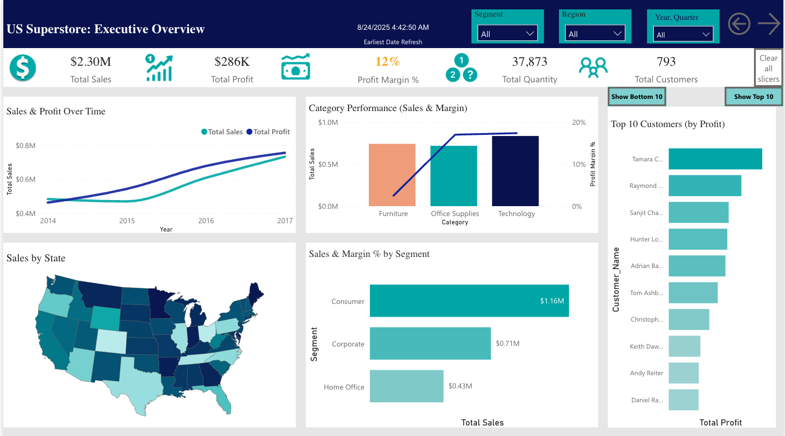
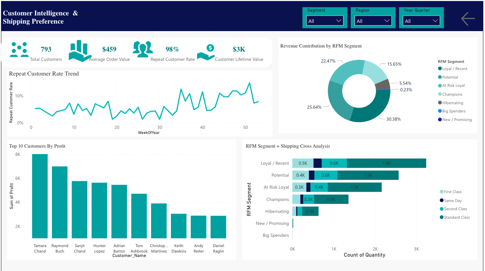

#  Driving Operational Excellence: US Superstore Profitability Analysis

### Project Overview
This project transforms raw transactional data from the US Superstore dataset into actionable business intelligence. By leveraging a SQL Server Star Schema and an interactive Power BI Dashboard, this analysis uncovers key profitability drivers, identifies regional performance gaps, and segments customers to drive operational excellence.  
### Key Pillars of Analysis:
**Profitability**: Deep dive into margins by category and sub-category.  
**Customer Intelligence**: RFM segmentation and Customer Lifetime Value (CLV) analysis.  
**Supply Chain**: Evaluation of regional sales performance and shipping mode efficiency.  

### The Technical Stack
**Database**: Microsoft SQL Server (Star Schema architecture).  
**ETL & Modeling**: T-SQL for data transformation and surrogate key assignment.  
**Analytics**: Power BI with advanced DAX for custom KPIs.  
**Infrastructure**: Azure Data Studio for SQL development.  

### Data Modeling (Star Schema)
To optimize performance, the raw flat file was reshaped into a Star Schema with five dimension tables centered around a single fact table:  

**DimDate**: Continuous date table for time-intelligence (YOY growth).  
**DimCustomer**: Segments: Consumer, Corporate, and Home Office.  
**DimProduct**: Three-level hierarchy (Category, Sub-Category, Product Name).  
**DimLocation**: Geographic granularity from State to Postal Code.  
**FactSales**: Transaction-level metrics including Sales, Quantity, Discount, and Profit.  

### Key Findings

**The "Discount Trap**: Heavy discounting in categories like Binders and Machines led to low margins, whereas high-margin items like Shredders (>40% margin) were under-promoted.   

**Regional Disparities**: The West region led with a 25% profit margin, while states like Texas and Illinois operated at a loss despite high sales volume.   

**Customer Loyalty**: 793 loyal customers drive a 98% repeat purchase rate, with "Champions" delivering a disproportionate share of total profit.

### Advanced DAX Metrics

The dashboard is powered by sophisticated measures, including:

**Return on Discount Investment (RODI)**: DIVIDE([Total Profit], [Total Discount Value ($)]).  
**Discount Impact Index**: Measures margin resilience relative to discounts.  
**Customer Lifetime Value (CLV)**: Dynamic calculation for long-term value assessment.  

### Strategic Recommendations

**Optimize Discounts**: Strengthen controls on low-return categories (Furniture/Binders) and focus spending on high-RODI items (Labels/Paper).   

**Targeted Loyalty**: Nurture "Potential" customers with tailored campaigns to convert them into high-value "Champions".   

**Regional Playbook**: Export the "West Region" margin discipline strategy to underperforming Central regions.
